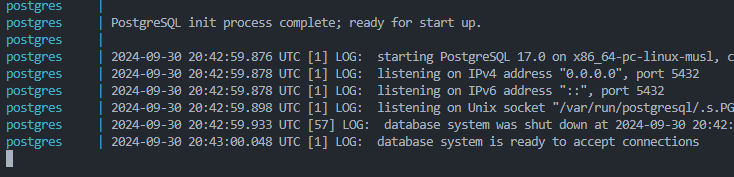
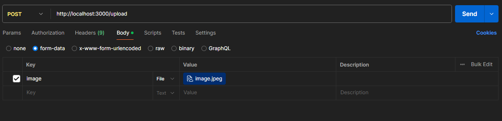
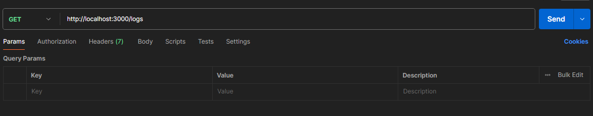

# Desafio Técnico

## Sistema de Reconhecimento de Marca de Cerveja em Microsserviços

1. Como executar o projeto
2. Arquitetura e tecnologias utilizadas
3. Exemplos

----------

## Como executar o projeto

1. Primeiro clone o repositório `git clone https://github.com/Thiago-CSantos/Desafio-Tecnico-Sistema-de-Reconhecimento-de-Marca-de-Cerveja-em-Microsservicos.git`
2. Segundo inicie o Docker na sua maquina, quando docker já estiver tudo OK!
execute o seguintes comando na raiz do projeto(onde se localiza o arquivo **docker-compose**) ` docker-compose up `.
4. Espere até que apareça que o postgres se conectou 
3. Espere terminar de criar os serviços e execute o comando ` docker-compose up app ` para executar o serviço do **NestJS** e rodar as migrations do banco.
4. Com isso já pode consumir a API.

----------

## Tecnologias utilizadas

- ### Microsserviço com Docker

- ### (Nest.Js) O **NestJS** usa uma arquitetura modular, baseada em módulos, para organizar o desenvolvimento de aplicativos

- ### Em **NestJS** foi usado o padrão MVC

- ### TypeScript(NestJS), Python(Flask), Tesseract(Reconhecer caracteres), Docker

- ### Conteinerização em Docker utilizando docker compose

### Arquitetura

O sistema é composto por dois microsserviços:

1. **Api(Nest.Js):** Recebe a imagem do cliente, valida o tipo da imagem faz a chamada do segundo serviço(ORC) guarda o retorno e armazena no banco de dados.

2. **ORC(Python):** Processa a imagem extraindo o texto da cerveja.

----------

## Exemplos

### Post(/upload) - Os tipos aceitos são image/jpeg', 'image/png', 'image/jpg'

### Get(/logs) - Consulta o log salvo da consulta /upload

para buscar pelo id basta passar (/logs/id)

----------

imagens para teste caso nescesario está no diretorio /image na raiz
artigo para melhorar a imagem https://medium.com/@genilsonmedeiros/reconhecimento-de-caracteres-em-imagens-com-tesseract-ocr-e-python-parte-3-84e8bd9d6298
